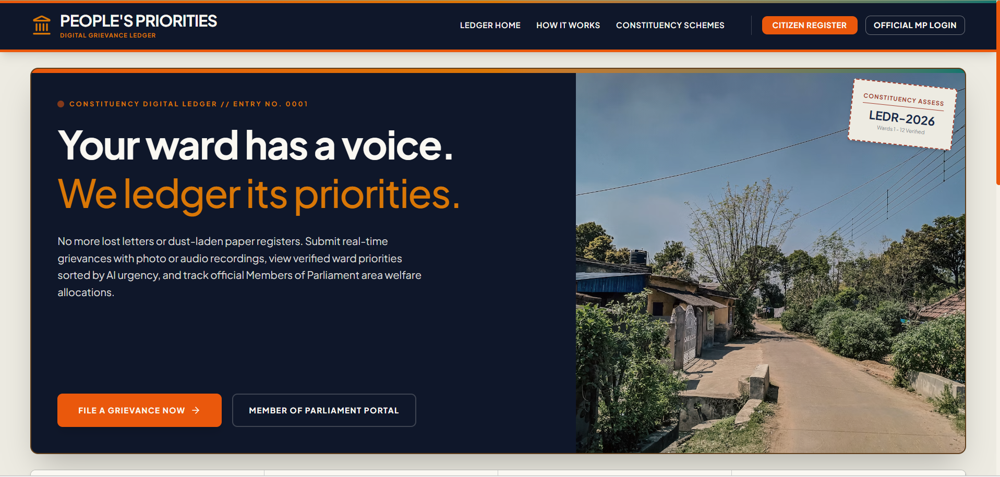

# People's Priorities

A digital grievance register that connects citizens directly to their MP's office — complaints get logged, AI-scored, and ranked so the office always knows what to fix first.

**Hackathon:** Google Cloud "Build with AI: Code for Communities"

**Live Demo:** [https://gdg-snowy.vercel.app](https://gdg-snowy.vercel.app)

---



---

## Features

- **Citizen Portal** – submit grievances with title, category, ward, description, photo, or voice note; track status; upvote other issues.
- **MP Dashboard** – view AI-summarized complaints ranked by urgency and impact; update status; manage welfare schemes; generate PDF reports.
- **AI Prioritization** – Gemini API scores complaints using the formula:
  ```
  priority_score = urgency × ln(estimated_impact + 1) × (1 + upvotes / 20)
  ```
- **Google Maps Integration** – visualize complaints on a constituency heatmap.
- **Offline Fallback** – keyword-based scoring works even without Gemini API key.
- **Responsive Design** – works on desktop and mobile.

## About the Project

Civic complaints usually go nowhere — a WhatsApp forward, a paper petition, a comment at a ward office — with no record and no way to compare which issues actually affect the most people.

**People's Priorities** fixes that with two portals:

- **Citizens** file a grievance, track its status, and upvote issues their neighbors raised.
- **MPs / staff** get a dashboard where every complaint is auto-summarized by Gemini AI, scored for urgency + impact, and ranked so the highest-priority issues surface automatically. They can also manage welfare schemes and generate PDF reports.

## Team Members

- **Supreet Mohapatra**
- **Ompreet Mohapatra**
- **Sudeshna Dash**

Gandhi Engineering College, Bhubaneswar

## Tech Stack

React 19 · Vite 6 · Tailwind CSS v4 · Firebase Auth · Google Cloud Firestore · Gemini API · Google Maps Platform · jsPDF

## Setup Guide

**Prerequisites:** Node.js 18+

```bash
# 1. Install dependencies
npm install

# 2. Copy env file and add your keys (both optional — app works without them)
cp .env.example .env
#   GEMINI_API_KEY            -> real AI scoring instead of fallback heuristic
#   GOOGLE_MAPS_PLATFORM_KEY  -> enables ward heatmap

# 3. Run locally
npm run dev
```
App runs at **http://localhost:3000**.

For production:
```bash
npm run build
npm start
```

### Creating `firebase-applet-config.json`

This file isn't in the repo (it holds your project's Firebase keys) — you need to create it yourself:

1. Go to the [Firebase Console](https://console.firebase.google.com) and create a new project (or open an existing one).
2. In **Project settings → General**, scroll to "Your apps" and click the **`</>`** (web) icon to register a new web app.
3. Firebase will show you a `firebaseConfig` object — you'll use these values in step 5.
4. Enable sign-in methods: go to **Authentication → Sign-in method** and turn on **Email/Password** and **Google**.
5. Enable the database: go to **Firestore Database → Create database** (start in production mode, since `firestore.rules` is already provided).
6. In the project root, create a file named `firebase-applet-config.json` with this shape, filled in with your values from step 3:

   ```json
   {
     "projectId": "your-project-id",
     "appId": "your-app-id",
     "apiKey": "your-api-key",
     "authDomain": "your-project-id.firebaseapp.com",
     "firestoreDatabaseId": "(default)",
     "storageBucket": "your-project-id.appspot.com",
     "messagingSenderId": "your-sender-id",
     "measurementId": ""
   }
   ```

7. Deploy the Firestore rules (needs the [Firebase CLI](https://firebase.google.com/docs/cli)):
   ```bash
   npm install -g firebase-tools
   firebase login
   firebase use --add        # select your project
   firebase deploy --only firestore:rules
   ```

That's it — `src/firebase.js` reads this file directly, so the app picks it up on the next `npm run dev`.

## Deploy to Vercel

The easiest way to deploy this app is to use [Vercel](https://vercel.com).

### Quick Deploy

1. **Install Vercel CLI** (optional – you can also use the Vercel Git integration):

   ```bash
   npm install -g vercel
   ```

2. **Deploy from your project root:**

   ```bash
   vercel --prod
   ```

   Follow the interactive prompts:
   - Link to existing project? → `n` (if first time)
   - Project name? → press Enter (auto-generate) or type `people-priorities`
   - Override settings? → `n` (Vercel auto-detects Vite)

3. **Set environment variables** in the Vercel dashboard:

   - Go to your project on [Vercel Dashboard](https://vercel.com/dashboard)
   - Click **Settings → Environment Variables**
   - Add the following variables (all `VITE_` prefixed are required for Firebase):

     | Key | Value |
     |-----|-------|
     | `VITE_FIREBASE_API_KEY` | Your Firebase API Key |
     | `VITE_FIREBASE_AUTH_DOMAIN` | `your-project-id.firebaseapp.com` |
     | `VITE_FIREBASE_PROJECT_ID` | Your Firebase Project ID |
     | `VITE_FIREBASE_STORAGE_BUCKET` | `your-project-id.appspot.com` |
     | `VITE_FIREBASE_MESSAGING_SENDER_ID` | Your sender ID |
     | `VITE_FIREBASE_APP_ID` | Your Firebase App ID |
     | `VITE_GOOGLE_MAPS_PLATFORM_KEY` | Your Google Maps API Key (optional) |

   - Click **Save** for each variable.

4. **Redeploy** with environment variables:

   ```bash
   vercel --prod
   ```

5. Your app is live at `https://your-project-name.vercel.app`.

### Git Integration (Automatic Deploys)

1. Push your code to GitHub.
2. Import the repository on Vercel.
3. Set environment variables in the Vercel dashboard.
4. Each push to `main` automatically redeploys.

## Demo Credentials

| Role | Username | Password |
|---|---|---|
| MP | `mp@people.in` | `password123` |
| Citizen | `citizen@people.in` | `password123` |

## Acknowledgments

- Google Cloud for providing Firebase, Gemini API, and Google Maps Platform credits.
- Google AI Studio for prototyping the Gemini integration.
- Vercel for hosting the live demo.

---

Happy coding! 🚀
